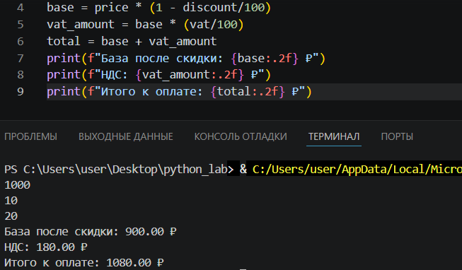

# python_lab

# Лабораторная работа 1
## Задание 1

Программа запрашивает имя и возраст, затем выводит приветствие.
## Задание 2

Программа получает два вещественных числа, выводит сумму и среднее.
## Задание 3

Программа считает НДС и выводит итоговую сумму к оплате