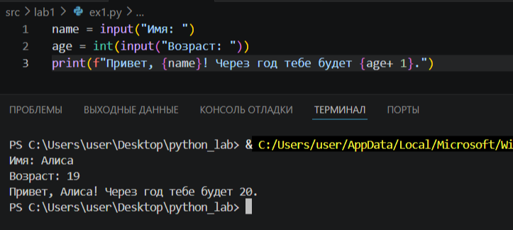
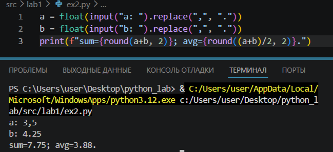

# python_lab

# Лабораторная работа 1
## Задание 1
Программа запрашивает имя и возраст, затем выводит приветствие.

## Задание 2

Программа получает два вещественных числа, выводит сумму и среднее.
