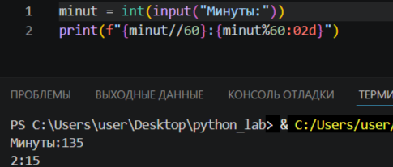
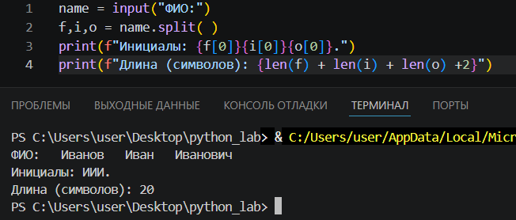

# python_lab

# Лабораторная работа 1
## Задание 1

Программа запрашивает имя и возраст, затем выводит приветствие.
## Задание 2

Программа получает два вещественных числа, выводит сумму и среднее.
## Задание 3

Программа считает НДС и выводит итоговую сумму к оплате.

## Задание 4

Программа получает на вход минуты, выводит в формате чч:мм.

## Задание 5

Программа получает ФИО, выделяет инициалы и считает символы.