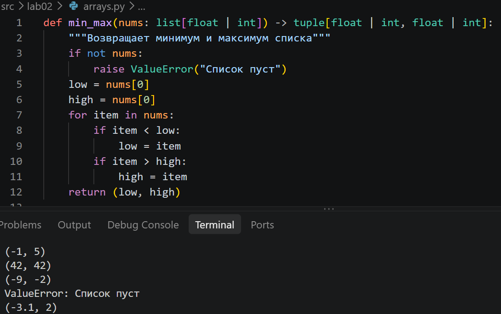
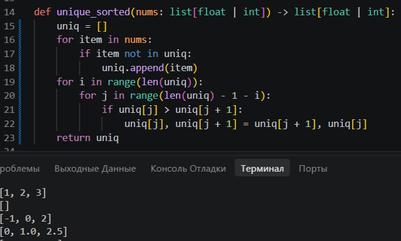
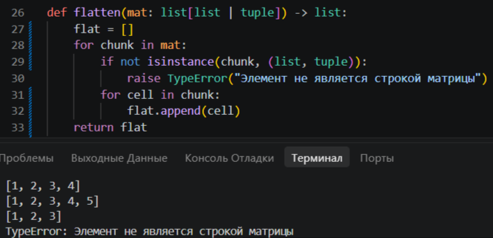
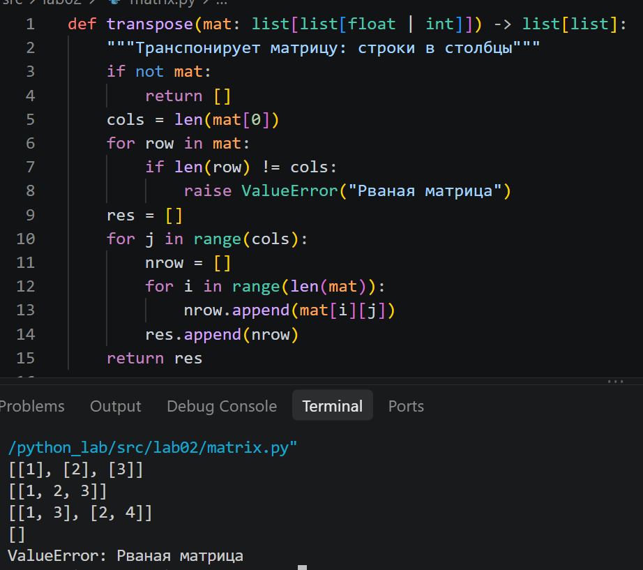
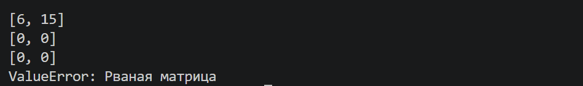
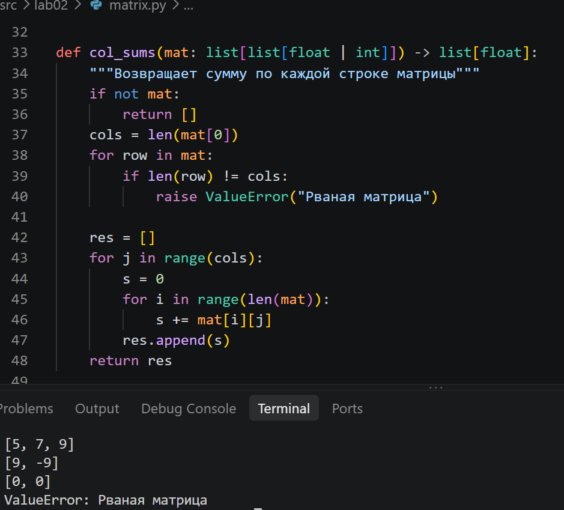
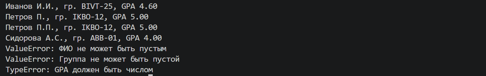

# python_lab

# Лабораторная работа 2
## Задание 1

## `min_max`

```python
def min_max(nums: list[float | int]) -> tuple[float | int, float | int]:
    """Возвращает минимум и максимум списка"""
    if not nums:
        raise ValueError("Список пуст")
    mn = nums[0]
    mx = nums[0]
    for item in nums:
        if item < mn:
            mn = item
        if item > mx:
            mx = item
    return (mn, mx)
```


Программа возвращает кортеж из минимума и максимума списка.

---

## `unique_sorted`

```python
def unique_sorted(nums: list[float | int]) -> list[float | int]:
    """Возвращает уникальные значения по возрастанию"""
    lst = []
    for item in nums:
        if item not in lst:
            lst.append(item)
    for i in range(len(lst)):
        for j in range(len(lst) - 1 - i):
            if lst[j] > lst[j + 1]:
                lst[j], lst[j + 1] = lst[j + 1], lst[j]
    return lst
```

Программа выводит новый список из уникальных значений исходного, отсортированный по возрастанию.

---

## `flatten`

```python
def flatten(mat: list[list | tuple]) -> list:
    """Разворачивает матрицу в один список"""
    lst = []
    for row in mat:
        if not isinstance(row, (list, tuple)):
            raise TypeError("Элемент не является строкой матрицы")
        for i in row:
            lst.append(i)
    return lst
```

Программа превращает список кортежей в один плоский список по строкам.

## Задание 2

## `transpose`

```python
def transpose(mat: list[list[float | int]]) -> list[list]:
    """Транспонирует матрицу: строки в столбцы"""
    if not mat:
        return []
    cols = len(mat[0])
    for row in mat:
        if len(row) != cols:
            raise ValueError("Рваная матрица")
    res = []
    for j in range(cols):
        nrow = []
        for i in range(len(mat)):
            nrow.append(mat[i][j])
        res.append(nrow)
    return res
```


Функция меняет строки и столбцы местами.

---

## `row_sums`

```python
def row_sums(mat: list[list[float | int]]) -> list[float]:
    """Возвращает сумму по каждой строке матрицы"""
    if not mat:
        return []
    cols = len(mat[0])
    for row in mat:
        if len(row) != cols:
            raise ValueError("Рваная матрица")
        
    res = []
    for row in mat:
        sm = 0
        for i in row:
            sm += i

        res.append(sm)
    return res
```


Функция выводит сумму по каждой строке.

---

## `col_sums`

```python
def col_sums(mat: list[list[float | int]]) -> list[float]:
    """Возвращает сумму по каждой строке матрицы"""
    if not mat:
        return []
    cols = len(mat[0])
    for row in mat:
        if len(row) != cols:
            raise ValueError("Рваная матрица")
        
    res = []
    for j in range(cols):
        sm = 0
        for i in range(len(mat)):
            sm += mat[i][j]
        res.append(sm)
    return res
```


Функция выводит сумму по каждому столбцу.

## Задание 3

## `format_record`
```python
def format_record(rec: tuple[str, str, float]) -> str:
    if type(rec) != tuple:
        raise TypeError("Запись должна быть кортежем")
    if len(rec) != 3:
        raise ValueError("В записи должно быть 3 элемента")
    fio, group, gpa = rec
    if type(fio) != str or type(group) != str:
        raise TypeError("ФИО и группа должны быть строками")
    if type(gpa) != int and type(gpa) != float:
        raise TypeError("GPA должен быть числом")
    if not fio.strip():
        raise ValueError("ФИО не может быть пустым")
    if not group.strip():
        raise ValueError("Группа не может быть пустой")
    if not (0 <= gpa <= 5):
        raise ValueError("GPA должен быть от 0 до 5")
    if len(fio.split()) != 2 and len(fio.split()) != 3:
        raise ValueError("Неверное ФИО")
    parts = fio.split()
    for p in parts:
        if not p.replace("-", "").isalpha():
            raise ValueError("ФИО должно состоять только из букв")
    surname = parts[0].capitalize()
    group = group.strip()
    initials = ""
    for p in parts[1:]:
        initials += p[0].upper() + "."
    return f"\"{surname} {initials}, гр. {group}, GPA {gpa:.2f}\""
```



Программа получает строку, убирает лишние пробелы, приводит к нужному виду и выводит.